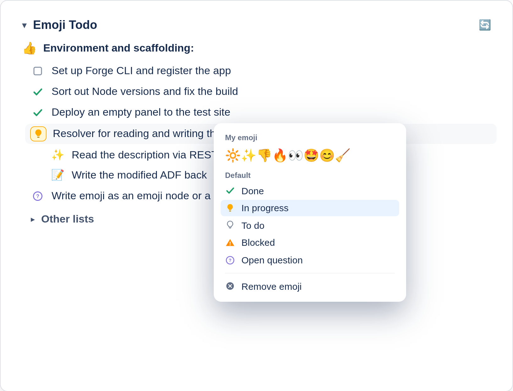

# Emoji To Do

## What it does

**Emoji To Do** turns the emoji checklists people already write in Jira descriptions into something you can *click*. Instead of opening the editor, finding the right emoji and retyping it, you hover over the emoji in the panel and pick a new status. The change is saved immediately — **no edit mode, no save button**.

The list itself stays where it always was: *in the issue description*. The app does not create a separate store, so your checklist travels with the issue through notifications, exports and search.

## Installation

1. Open **Apps → Explore more apps** in your Jira Cloud site, or install directly from the Atlassian Marketplace listing.
2. Confirm the requested permissions. The app needs **read and write access to Jira work items** in order to read the description and update the emoji in it.
3. Open any work item. The **Emoji Todo** panel appears in the right-hand column, below the built-in sections.

*No configuration is required.* Any user who can edit the issue can change statuses; users without edit rights see the list read-only.

## Writing a list

Write a normal bulleted list in the issue description and start each item with an emoji:

```
* 💡 Draft the migration plan
* 🔅 Set up the staging topics
* ✅ Agree on the message format
```

That's the whole syntax. The app picks the list up automatically the next time the panel loads.

### Tips

- Type `:bulb:` in the Jira editor rather than pasting an emoji character — this produces a proper emoji node and is recognised most reliably.
- Any text that isn't an emoji-prefixed list item is left alone. You can mix paragraphs, headings and regular lists freely.
- Multiple lists in one description are supported.

## Status vocabulary

| Emoji | Shortcode | Meaning |
| :---: | --- | --- |
| 💡 | `:bulb:` | To do |
| 🔅 | `:dim_button:` | In progress |
| ✅ | `:white_check_mark:` | Done |
| ⚠️ | `:warning:` | Problem or blocked |
| ❓ | `:question:` | Open question |

## Changing a status

1. Open the **Emoji Todo** panel on a work item.
2. Hover over the emoji of the item you want to change.
3. Pick a new status from the picker.



The description updates immediately. If someone edited the description while your panel was open, the app tells you the content is *out of date* and offers to reload rather than overwriting their change.

## Known limitations

- Item text, ordering and nesting are edited in the Jira editor, **not** in the panel. The panel only changes the emoji.
- Emoji pasted as plain characters may not be recognised in every case. Use the `:shortcode:` form if an item doesn't appear in the panel.
- The panel is rendered below the built-in issue sections and its position **cannot be changed**.
- Jira Service Management is **not officially supported** yet.

## Support

Questions, bug reports and feature requests: **atlassian@chiv.info**.

Please include the *Jira site URL* and, where possible, the *description text* that reproduces the problem.
